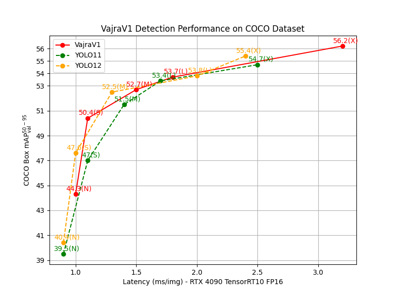
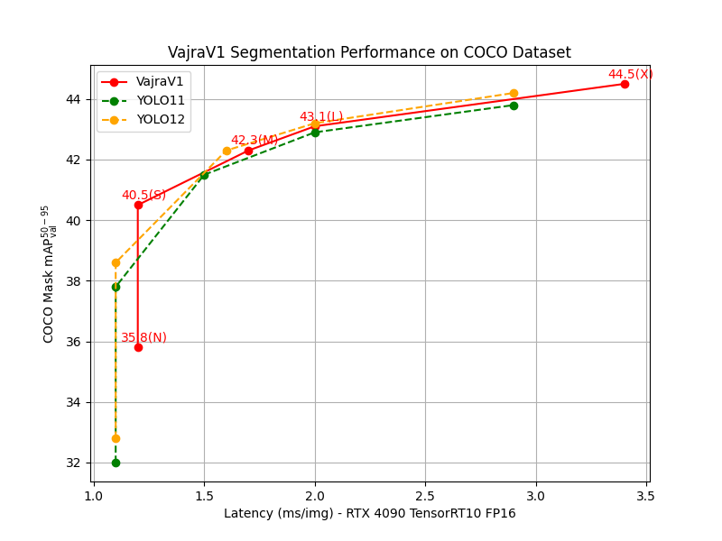
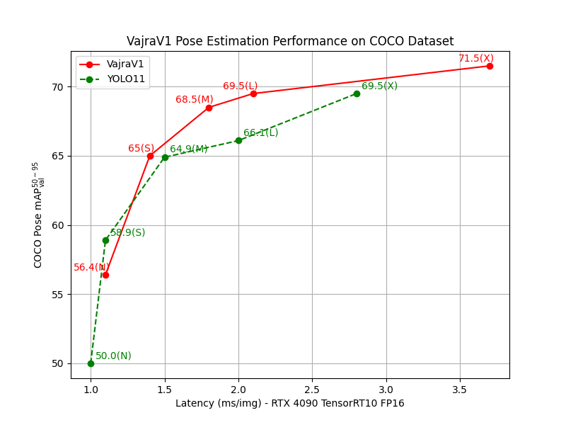
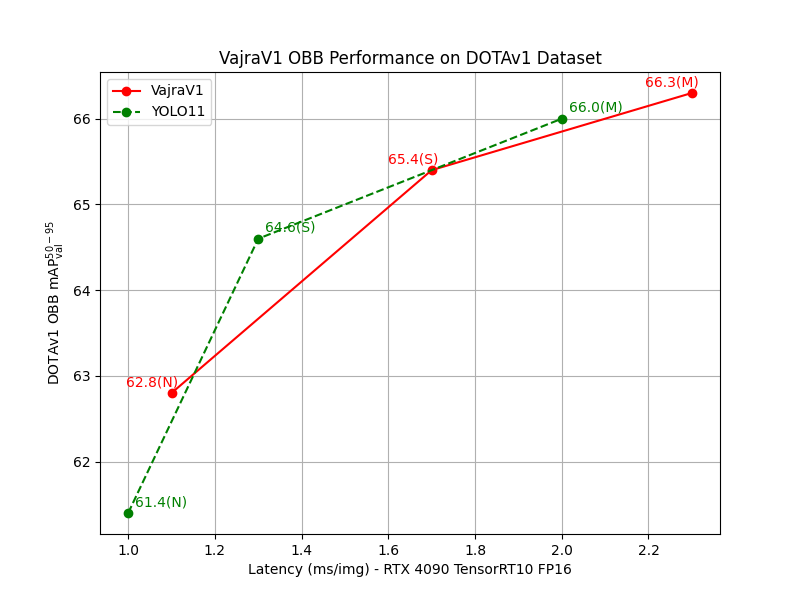

<div align="center">

</div>

Vayuvahana Technologies Private Limited [VajraV1](https://github.com/NamanMakkar/VayuAI) is a 
state-of-the-art (SOTA) real time object detection model inspired by the YOLO model architectures. VajraV1 is a family of fast, lightweight models that can be used for a variety of tasks like object detection and tracking, instance segmentation, oriented object detection, pose detection, and image classification.

## <div align="center">Enterprise License</div>
To request for an Enterprise License please get in touch via [Email](mailto:namansingh2803@gmail.com)

## <div align="center">Performance on COCO Dataset</div>

| Model                                                                                | Size (pixels) | mAP<sup>val<br>50-95</sup> | Speed<br><sup>RTX 4090 TensorRT10 Latency (ms)</sup> | Params (M) | FLOPs (B) |
|-------------------------------------------------------------------------------------|---------------|----------------------------|-----------------------------------------------------|------------|-----------|
| [VajraV1-nano-det](https://github.com/NamanMakkar/VayuAI/releases/download/v1.0.4/vajra-v1-nano-det.pt) | 640           | 44.3                       | 1.0                                                 | 3.78       | 13.7       |
| [VajraV1-small-det](https://github.com/NamanMakkar/VayuAI/releases/download/v1.0.4/vajra-v1-small-det.pt)  | 640           | 50.4                       | 1.1                                                 | 11.58      | 47.9      |
| [VajraV1-medium-det](https://github.com/NamanMakkar/VayuAI/releases/download/v1.0.4/vajra-v1-medium-det.pt)  | 640           | 52.7                           | 1.5                                                 | 20.29      | 94.5      |
| [VajraV1-large-det](https://github.com/NamanMakkar/VayuAI/releases/download/v1.0.4/vajra-v1-large-det.pt)  | 640           | 53.7                           | 1.8                                                 | 24.63      | 115.2      |
| [VajraV1-xlarge-det](https://github.com/NamanMakkar/VayuAI/releases/download/v1.0.4/vajra-v1-xlarge-det.pt)  | 640           | 56.2                           | 3.2                                                 | 72.7      | 208.3     |


<p align="center">

</p>

## <div align="center">Segmentation Performance on COCO Dataset</div>
| Model                                                                                | Size (pixels) | Box mAP<sup>val<br>50-95</sup> | Mask mAP<sup>val<br>50-95</sup> | Speed<br><sup>RTX 4090 TensorRT10 Latency (ms)</sup> | Params (M) | FLOPs (B) |
|-------------------------------------------------------------------------------------|---------------|-------------------------------|-------------------------------|-----------------------------------------------------|------------|-----------|
| [VajraV1-nano-seg](https://github.com/NamanMakkar/VayuAI/releases/download/v1.0.4/vajra-v1-nano-seg.pt) | 640           | 43.6                          | 35.8                             | 1.2                                                 | 4.03       | 17.6      |
| [VajraV1-small-seg](https://github.com/NamanMakkar/VayuAI/releases/download/v1.0.4/vajra-v1-small-seg.pt) | 640           | 50.2                          | 40.5                             | 1.2                                                 | 12.23      | 61.9      |
| [VajraV1-medium-seg](https://github.com/NamanMakkar/VayuAI/releases/download/v1.0.4/vajra-v1-medium-seg.pt) | 640           | 52.6                          | 42.3                             | 1.7                                                 | 22.6      | 149.9      |
| [VajraV1-large-seg](https://github.com/NamanMakkar/VayuAI/releases/download/v1.0.4/vajra-v1-large-seg.pt) | 640           | 53.6                          | 43.1                             | 2.0                                                 | 26.93      | 170.6     |
| [VajraV1-xlarge-seg](https://github.com/NamanMakkar/VayuAI/releases/download/v1.0.4/vajra-v1-xlarge-seg.pt) | 640           | 55.7                          | 44.5                             | 3.4                                                 | 75       | 278.1     |

<p align="center">

</p>

## <div align="center">Pose Estimation Performance on COCO Dataset</div>
| Model                                                                                | Size (pixels) | Pose mAP<sup>val<br>50-95</sup> | Pose mAP<sup>val<br>50</sup> | Speed<br><sup>RTX 4090 TensorRT10 Latency (ms)</sup> | Params (M) | FLOPs (B) |
|-------------------------------------------------------------------------------------|---------------|-------------------------------|-------------------------------|-----------------------------------------------------|------------|-----------|
| [VajraV1-nano-pose](https://github.com/NamanMakkar/VayuAI/releases/download/v1.0.4/vajra-v1-nano-pose.pt) | 640           | 56.4                          | 84.7                             | 1.2                                                 | 4.07       | 14.8      |
| [VajraV1-small-pose](https://github.com/NamanMakkar/VayuAI/releases/download/v1.0.4/vajra-v1-small-pose.pt) | 640           | 65                          | 88.9                             | 1.4                                                 | 12.07      | 49.6      |
| [VajraV1-medium-pose](https://github.com/NamanMakkar/VayuAI/releases/download/v1.0.4/vajra-v1-medium-pose.pt) | 640           | 68.5                          | 89.9                             | 1.8                                                 | 21.15      | 98.2      |
| [VajraV1-large-pose](https://github.com/NamanMakkar/VayuAI/releases/download/v1.0.4/vajra-v1-large-pose.pt) | 640           | 69.5                          | 90.6                             | 2.1                                                 | 25.49      | 118.9     |
| [VajraV1-xlarge-pose](https://github.com/NamanMakkar/VayuAI/releases/download/v1.0.4/vajra-v1-xlarge-pose.pt) | 640           | 71.5                          | 91.4                             | 3.7                                                 | 73.56       | 226.5      |

<p align="center">

</p>


## <div align="center">Oriented Bounding Box Object Detection Performance on the DOTAv1 Dataset</div>
| Model                                                                                | Size (pixels) | OBB mAP<sup>val<br>50-95</sup>  Original | OBB mAP<sup>val<br>50-95</sup> Multi-Scale | Speed<br><sup>RTX 4090 TensorRT10 Latency (ms)</sup> | Params (M) | FLOPs (B) |
|-------------------------------------------------------------------------------------|---------------|-------------------------------|-------------------------------|-----------------------------------------------------|------------|-----------|
| [VajraV1-nano-obb](https://github.com/NamanMakkar/VayuAI/releases/download/v1.0.6/vajra-v1-nano-obb.pt) | 1024           | 50.8                          | 62.8                             | 1.1                                                 | 3.82       | 35.8      |
| [VajraV1-small-obb](https://github.com/NamanMakkar/VayuAI/releases/download/v1.0.6/vajra-v1-small-obb.pt) | 1024           | 54.9                          | 65.4                             | 1.7                                                 | 11.84      | 124.8      |
| [VajraV1-medium-obb](https://github.com/NamanMakkar/VayuAI/releases/download/v1.0.6/vajra-v1-medium-obb.pt) | 1024           | 55.9                          | 66.3                             | 2.3                                                 | 21.09      | 251.3      |

<p align="center">

</p>

## <div align="center">Documentation</div>

<details open>
<summary>Install</summary>

Git clone the VayuAI SDK including all [requirements](https://github.com/NamanMakkar/VayuAI/blob/main/pyproject.toml) in a [**Python>=3.8**](https://www.python.org) environment.

```bash
git clone https://github.com/NamanMakkar/VayuAI.git
cd VayuAI
pip install .
```
</details>

<details open>
<summary>Usage</summary>

### CLI
Vajra can be used in the Command Line Interface with a `vajra` or `vayuvahana` or `vayuai`
command:

```bash
vajra predict model=vajra-v1-nano-det img_size=640 source="path/to/source.jpg"
```

### Python
Vajra can also be used directly in a Python environment, and accepts the same arguments as in the CLI example above:

```python
from vajra import Vajra
model = Vajra("vajra-v1-nano-det")

train_results = model.train(
    data="coco8.yaml",
    epochs=100,
    img_size=640,
    device="cpu",
    weight_decay=0.,
)

metrics = model.val()
results = model("path/to/img.jpg")
results[0].show()

path = model.export(format="onnx")
```

Pretrained COCO weights can also be used for model inference 

```python
from vajra import Vajra
model = Vajra("vajra-v1-xlarge-det.pt")
results = model("path/to/img.jpg")
results[0].show()

path = model.export(format="engine", device=0, half=True)
```
</details>

## Tasks Supported

✅ detect  
✅ pose  
✅ obb  
✅ segment  
✅ small_obj_detect  
✅ classify  
✅ multilabel_classify  

## Modes Supported

✅ Training  
✅ Validation  
✅ Prediction  
✅ Multi-object Tracking  
✅ Model Export -> (TensorRT, ONNX, OpenVINO, Torchscript, CoreML, TensorFlow.js, NCNN, Keras, PaddlePaddle)  
✅ Benchmarking  


## Model Architectures

✅ VajraV1-det  
✅ VajraV1-cls  
✅ VajraV1-pose  
✅ VajraV1-seg  
✅ VajraV1-obb  
✅ SAM  
✅ SAM2  
✅ FastSAM  
✅ MobileSAM  
✅ EfficientNetV1  
✅ EfficientNetV2  
✅ VajraEffNetV1  
✅ VajraEffNetV2  
✅ ConvNeXtV1  
✅ ConvNeXtV2  
✅ ResNet  
✅ ResNeSt  
❌ ResNeXt (Coming Soon!)  
❌ ResNetV2 (Coming Soon!)  
✅ EdgeNeXt  
✅ ME-NeSt  
✅ VajraME-NeSt  
✅ MixConvNeXt  
❌ ViT (Coming Soon!)  
❌ Swin (Coming Soon!)  
❌ SwinV2 (Coming Soon!)   

## Model Architecture Details

**VajraV1 - The most accurate Real Time Object Detector of the YOLO family**
arXiv: [https://arxiv.org/abs/2512.13834](https://arxiv.org/abs/2512.13834)

## Citation

If you use VajraV1 and VayuAI SDK in your research please cite the following:

```latex
@misc{makkar2025vajrav1accuratereal,
      title={VajraV1 -- The most accurate Real Time Object Detector of the YOLO family}, 
      author={Naman Balbir Singh Makkar},
      year={2025},
      eprint={2512.13834},
      archivePrefix={arXiv},
      primaryClass={cs.CV},
      url={https://arxiv.org/abs/2512.13834}, 
}
```

```
@software{vajrav1_vayuai,
          author = {Naman Balbir Singh Makkar},
          title = {{Vayuvahana Technologies VajraV1}},
          version = {1.0.6},
          year = {2026},
          url = {https://github.com/NamanMakkar/VayuAI},
}
```

## Acknowledgements

- [https://github.com/ultralytics/ultralytics](https://github.com/ultralytics/ultralytics)
- [https://github.com/ultralytics/yolov5](https://github.com/ultralytics/yolov5)
- [https://github.com/ouyanghaodong/DEYOv1.5](https://github.com/ouyanghaodong/DEYOv1.5)
- [https://github.com/WongKinYiu/yolov9](https://github.com/WongKinYiu/yolov9)
- [https://github.com/meituan/YOLOv6](https://github.com/meituan/YOLOv6)
- [https://github.com/huggingface/pytorch-image-models](https://github.com/huggingface/pytorch-image-models)
- [https://github.com/pytorch/vision](https://github.com/pytorch/vision)

## <div align="center">License</div>

Vayuvahana Technologies Private Limited offers two licensing options:

- **AGPL-3.0 License**: This is an [OSI-approved](https://opensource.org/license) open-source
license for researchers for the purpose of promoting collaboration. See the [LICENSE](https://github.com/NamanMakkar/VayuAI/blob/main/LICENSE) file for details.

- **Enterprise License**: This license is designed for commercial use and enables integration of 
VayuAI software and AI models into commercial goods and services, bypassing the open-source requirements of AGPL-3.0. If your product requires embedding the software for commercial purposes or require access to more capable enterprise AI models in the future, reach out via [Email](mailto:namansingh2803@gmail.com).